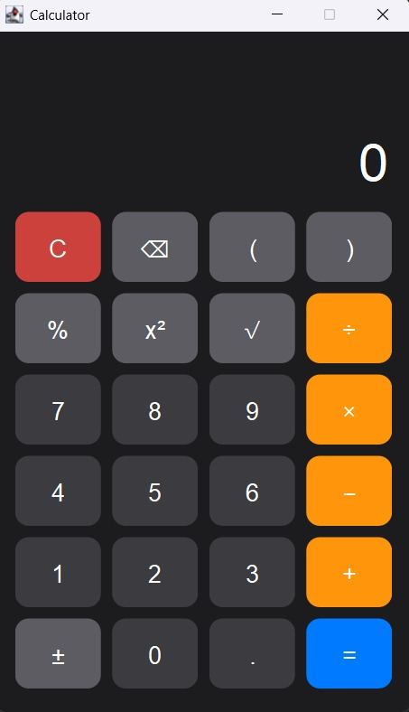

# Java Swing Calculator

A desktop calculator built with **Java Swing**. The project provides a modern dark interface, expression parsing, keyboard input, and common scientific-style calculator operations while keeping the code organized into separate classes.

## Features

- Addition, subtraction, multiplication, and division
- Percentage calculation
- Square (`x²`) and square root (`√`)
- Parentheses and operator precedence
- Positive/negative toggle (`±`)
- Backspace and clear controls
- Decimal numbers and scientific notation support
- Keyboard input for common calculator operations
- Division-by-zero and invalid-expression handling
- Rounded custom buttons with hover and pressed states
- Expression preview and calculation history
- Automatic display formatting for large and small values

## Project Structure

```text
Java-Calculator-GitHub/
├── src/
│   └── calculator/
│       ├── Calculator.java
│       ├── ExpressionParser.java
│       ├── Main.java
│       └── RoundButton.java
├── test/
│   └── calculator/
│       └── CalculatorSmokeTest.java
├── .gitignore
└── README.md
```

## Requirements

- Java Development Kit (JDK) 17 or later
- No external libraries are required

## How to Run

### Compile the application

From the project root:

```bash
javac -encoding UTF-8 -d out src/calculator/*.java
```

### Run the calculator

```bash
java -cp out calculator.Main
```

## 📱 App Screenshot



## Run the Smoke Test

Compile the application and test source files:

```bash
javac -encoding UTF-8 -d out src/calculator/*.java test/calculator/CalculatorSmokeTest.java
```

Then run:

```bash
java -ea -cp out calculator.CalculatorSmokeTest
```

Expected output:

```text
Smoke tests passed.
```

## IDE Setup

You can open the project folder directly in IntelliJ IDEA, Eclipse, or VS Code. Mark `src` as the source folder and run `calculator.Main`.

## Author

**Ziad Omar**  
Computer Science Student | Software Testing Enthusiast

- GitHub: [Add your GitHub profile link here](https://github.com/)
- LinkedIn: [eng-ziad-omar](https://www.linkedin.com/in/eng-ziad-omar-/)

## License

This project is available for educational and portfolio purposes.